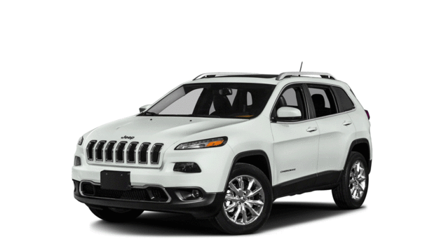

# Awesome Vehicle Security 

*A curated list of awesome resources, books, hardware, software, applications, people to follow, and more cool stuff about vehicle security, car hacking, and tinkering with the functionality of your car.*

---

I would love as much help as I can get. [Start contributing!](https://github.com/jaredmichaelsmith/awesome-vehicle-security/blob/master/contributing.md)

Follow me on [Twitter](https://twitter.com/jaredthecoder) for more security goodness.

---

# Contents

- [Learn](#learn)
    - [Articles](#articles)
    - [Presentations](#presentations)
    - [Books](#books)
    - [Research Papers](#research-papers)
    - [Courses](#courses)
    - [Blogs](#blogs)
    - [Websites](#websites)
    - [Newsletters](#newsletters)
    - [Conferences](#conferences)
    - [Who to Follow](#who-to-follow)
    - [Podcasts and Episodes](#podcasts-and-episodes)
        - [Podcasts](#podcasts)
        - [Episodes](#episodes)
    - [Miscellaneous](#miscellaneous)
- [Projects](#projects)
- [Hardware](#hardware)
- [Software](#software)
  - [Applications](#applications)
  - [Libraries and Tools](#libraries-and-tools)
    - [C](#c)
    - [Python](#python)
    - [Go](#go)
    - [JavaScript](#javascript)
- [Companies and Jobs](#companies-and-jobs)
    - [Coordinated Disclosure](#coordinated-disclosure)
- [Other Awesome Lists](#other-awesome-lists)
- [Contributing](#contributing)

# Learn

## Articles

- [How to hack a car — a quick crash-course](https://medium.freecodecamp.org/hacking-cars-a-guide-tutorial-on-how-to-hack-a-car-5eafcfbbb7ec) - Car enthusiast Kenny Kuchera illustrates just enough information to get you up and running. An excellent resource for first timers!
- [Stopping a Jeep Cherokee on the Highway Remotely](https://www.wired.com/2015/07/hackers-remotely-kill-jeep-highway/) - Chris Valasek's and Charlie Miller's pivotal research on hacking into Jeep's presented at DEFCON in 2015.
- [Troy Hunt on Controlling Nissans](https://www.troyhunt.com/controlling-vehicle-features-of-nissan/) - Troy Hunt goes into controlling Nissan vehicles.
- [Tesla hackers explain how they did it at Defcon](http://www.cnet.com/roadshow/news/tesla-hackers-explain-how-they-did-it-at-def-con-23/) - Overview of DEFCON 23 presentation on hacking into Tesla cars.
- [Anatomy of the Rolljam Wireless Car Hack](http://makezine.com/2015/08/11/anatomy-of-the-rolljam-wireless-car-hack/) - Overview of the RollJam rolling code exploitation device.
- [IOActive's Tools and Data](http://blog.ioactive.com/2013/08/car-hacking-content.html) - Chris Valasek and Charlie Miller release some of their tools and data for hacking into vehicles in an effort to get more people into vehicle security research.
- [Developments in Car Hacking](https://www.sans.org/reading-room/whitepapers/ICS/developments-car-hacking-36607) - via the SANS Reading Room, Currie's paper analyses the risks and perils of smart vehicle technology.
- [Car Hacking on the Cheap](http://www.ioactive.com/pdfs/IOActive_Car_Hacking_Poories.pdf) -  A whitepaper from Chris Valasek and IOActive on hacking your car when you don't have a lot of resources at your disposal.
- [Car Hacking: The definitive source](http://illmatics.com/carhacking.html) - Charlie Miller and Chris Valasek publish all tools, data, research notes, and papers for everyone for free
- [Car Hacking on the cheap](https://community.rapid7.com/community/transpo-security/blog/2017/02/08/car-hacking-on-the-cheap) - Craig Smith wrote a brief article on working with Metasploit’s HWBrige using ELM327 Bluetooth dongle
- [Researchers tackle autonomous vehicle security](https://phys.org/news/2017-05-tackle-autonomous-vehicle.html) - Texas A&M researchers develop intelligence system prototype.
- [How big data will impact car security in the proximate future: Concerns and solutions](http://bigdata-madesimple.com/big-data-will-impact-car-security-proximate-future-concerns-solutions/) - Impact of big data on car security.
- [Reverse engineering of the Nitro OBD2](https://blog.quarkslab.com/reverse-engineering-of-the-nitro-obd2.html) - Reverse engineering of CAN diagnostic tools.
- [Analysis of an old Subaru Impreza - Subaru Select Monitor v1 (SSM1)](https://p1kachu.pluggi.fr/project/automotive/2018/12/28/subaru-ssm1/) - Digging into an old ECU through an old protocol and disabling a 1997 Subaru Impreza's speed limiter.

## Presentations

- ["Hopping on the CAN Bus" from BlackHat Asia 2015](https://www.blackhat.com/asia-15/briefings.html#hopping-on-the-can-bus) - A talk from BlackHat Asia 2015 that aims to enable the audience to "gain an understanding of automotive systems, but will also have the tools to attack them".
- ["Drive It Like You Hacked It" from DEFCON 23](https://samy.pl/defcon2015/) - A talk and slides from Samy Kamkar's DEFCON 23/2015 talk that includes hacking garages, exploiting automotive mobile apps, and breaking rolling codes to unlock any vehicle with low cost tools.
- [Samy Kamkar on Hacking Vehicles with OnStar](https://www.youtube.com/watch?v=3olXUbS-prU&feature=youtu.be) - Samy Kamkar, the prolific hacker behind the Samy worm on MySpace, explores hacking into vehicles with OnStar systems.
- [Remote Exploitation of an Unaltered Passenger Vehicle](https://www.youtube.com/watch?v=OobLb1McxnI) - DEFCON 23 talk Chris Valasek and Charlie Miller give their now famous talk on hacking into a Jeep remotely and stopping it dead in its tracks.
- [Adventures in Automotive Networks and Control Units](https://www.youtube.com/watch?v=n70hIu9lcYo) - DEFCON 21 talk by Chris Valasek and Charlie Miller on automotive networks.
- [Can You Trust Autonomous Vehicles?](https://www.youtube.com/watch?v=orWqKWvIW_0) - DEFCON 24 talk by Jianhao Liu, Chen Yan, Wenyuan Xu
- [Ken Munro & Dave Lodge - Hacking the Mitsubishi Outlander & IOT](https://www.youtube.com/watch?v=YLBQdO6a5IQ) - talk from BSides Manchester 2016 by Ken and Dave of [Pen Test Partners](#who-to-follow)
- [A Platform base on Visualization for Protecting CAN Bus Security](https://www.syscan360.org/slides/2016_SH_Jianhao_Liu_A_platform_base_on_visualization_for_protecting_CAN_bus_security.pdf) - Syscan360 2016 SH talk by Jianhao Liu
- [Gateway Internals of Tesla Motors](https://2016.zeronights.ru/wp-content/uploads/2016/12/Gateway_Internals_of_Tesla_Motors_v6.pdf) - Zeronights 2016 talk by Nie Seng and Liu Ling
- [Car Hacking 101](https://www.youtube.com/watch?v=P-mzo2X47sg) - Bugcrowd LevelUp 2017 by Alan Mond
- [State of Automotive Cyber Safety, 2015](https://www.youtube.com/watch?v=g-a20ORka-A) - State of automotive hacking, policy, industry changes, etc. from I Am The Cavalry track at BSides Las Vegas, 2015.
- [State of Automotive Cyber Safety, 2016](https://www.youtube.com/watch?v=WcObDVy2-1I) - State of automotive hacking, policy, industry changes, etc. from I Am The Cavalry track at BSides Las Vegas, 2016.
- [How to Hack a Tesla Model S](https://www.youtube.com/watch?v=KX_0c9R4Fng) - DEF CON 23 talk by Marc Rogers and Kevin Mahaffey on hacking a Tesla. Tesla Co-Founder and CTO, JB Straubel, joins them to thank them and present a challenge coin.
- [Car Hacking Videos](http://tekeye.uk/automotive/cyber-security/car-hacking-videos) -  A web page with a long list of videos (40+) that are available online related to the topic of car hacking. From a 2007 DEF CON talk on modding engine ECUS and onwards (e.g. the 2017 Keen Security Tesla hack).
- [Self-Driving and Connected Cars: Fooling Sensors and Tracking Drivers](https://www.youtube.com/watch?v=C29UGFsIWVI) - Black Hat talk by Jonathan Petit. Automated and connected vehicles are the next evolution in transportation and will improve safety, traffic efficiency and driving experience. This talk will be divided in two parts: 1) security of autonomous automated vehicles and 2) privacy of connected vehicles. 2015
- [A Survey of Remote Automotive Attack Surfaces](https://www.youtube.com/watch?v=MAGacjNw0Sw) - Black Hat talk By Charlie Miller and Chris Valasek. Automotive security concerns have gone from the fringe to the mainstream with security researchers showing the susceptibility of the modern vehicle to local and remote attacks. Discussion of vehicle attack surfaces. 2014.
- [Pentesting vehicles with YACHT (Yet Another Car Hacking Tool)](https://www.blackhat.com/docs/eu-16/materials/eu-16-Sintsov-Pen-Testing-Vehicles-With-Cantoolz.pdf) -A presentation that discuesses different attack surfaces of a vehicle, then continues to describe an approach to car hacking along with tools needed to analyse and gather useful information.
- [How to drift with any car](https://www.youtube.com/watch?v=KU7gl1n1tIs) - Introduction to CAN hacking, and using a real car as an Xbox controller.

## Books

- [2014 Car Hacker's Handbook](http://opengarages.org/handbook/) - Free guide to hacking vehicles from 2014. You can also buy the book on Amazon [here](https://www.amazon.com/Car-Hackers-Manual-Craig-Smith/dp/0990490106?ie=UTF8&keywords=2014%20car%20hacker%27s%20manual&qid=1405445024&ref_=sr_1_1&sr=8-1).
- [2016 Car Hacker's Handbook](https://www.amazon.com/Car-Hackers-Handbook-Penetration-Tester/dp/1593277032) - Latest version of the Car Hacker's handbook with updated information to hack your own vehicle and learning vehicle security. For a physical copy as well unlimited PDF, MOBI, and EPUB copies of the book, buy it at [No Starch Press](https://www.nostarch.com/carhacking). Sections are available online [here](https://books.google.com/books?id=Ao_QCwAAQBAJ&lpg=PP1&dq=car%20hacking&pg=PP1#v=onepage&q&f=false).
- [A Comprehensible Guide to Controller Area Network](https://www.amazon.com/Comprehensible-Guide-Controller-Area-Network/dp/0976511606/ref=pd_sim_14_1?ie=UTF8&dpID=41-D9UhlE9L&dpSrc=sims&preST=_AC_UL160_SR124%2C160_&psc=1&refRID=3FH8N10610H0RX8SMB6K) - An older book from 2005, but still a comprehensive guide on CAN buses and networking in vehicles.
- [智能汽车安全攻防大揭秘](https://www.amazon.cn/dp/B075QZXY7W)This book first introduced some basic knowledge of security for automotive R&D personnel, such as encryption and decryption, security authentication, digital signatures, common attack types, and methods. Then it introduced the working principles of some smart cars for security researchers, such as the automotive intranet. Protocol, network architecture, principle of X-By-Wire remote control system, common potential attack surface, etc. Finally, a detailed analysis of some actual automotive attack or security test cases, and defense analysis of the loopholes involved in the case during the analysis process.
- [Controller Area Network Prototyping with Arduino](https://www.amazon.com/Controller-Area-Network-Prototyping-Arduino/dp/1938581164/ref=pd_sim_14_2?ie=UTF8&dpID=51J27ZEcl9L&dpSrc=sims&preST=_AC_UL160_SR123%2C160_&psc=1&refRID=V42FKNW09QGVGHW7ZFRR) - This book guides you through prototyping CAN applications on Arduinos, which can help when working with CAN on your own car.
- [Embedded Networking with CAN and CANopen](https://www.amazon.com/Embedded-Networking-CANopen-Olaf-Pfeiffer/dp/0929392787/ref=pd_sim_14_37?ie=UTF8&dpID=41UnLKYFpmL&dpSrc=sims&preST=_AC_UL160_SR122%2C160_&psc=1&refRID=V42FKNW09QGVGHW7ZFRR) - From 2003, this book fills in gaps in CAN literature and will educate you further on CAN networks and working with embedded systems.
- [Inside Radio: An Attack and Defense Guide](https://unicorn.360.com/blog/2018/01/29/Inside_Radio_An_Attack_and_Defense_Guide)This book discusses the security issues in a wide range of wireless devices and systems,Chapter 4 433/315MHz Communication (4.3　4.4 4.5 is about car keys Security)

## Research Papers

- [Koscher et al. Experimental Security Analysis of a Modern Automobile, 2010](http://www.autosec.org/pubs/cars-oakland2010.pdf)
- [Comprehensive Experimental Analyses of Automotive Attack Surfaces, 2011](http://static.usenix.org/events/sec11/tech/full_papers/Checkoway.pdf)
- [Miller and Valasek](http://illmatics.com/carhacking.html) - Self proclaimed "car hacking the definitive source".
  - [Adventures in Automotive Networks and Control Units (aka car hacking)](http://illmatics.com/car_hacking.pdf)
  - [Car Hacking for Poories](http://illmatics.com/car_hacking_poories.pdf)
  - [A Survey of Remote Automotive Attack Surfaces, 2014](http://illmatics.com/remote%20attack%20surfaces.pdf)
  - [Remote Compromise of an Unaltered Passenger Vehicle (aka The Jeep Hack), 2015](http://illmatics.com/Remote%20Car%20Hacking.pdf)
  - [Advanced CAN Message Injection, 2016](http://illmatics.com/can%20message%20injection.pdf)
- [5-Star Automotive Cyber Safety Framework, 2015](https://iamthecavalry.org/5star)
- [A Vulnerability in Modern Automotive Standards and How We Exploited It](https://documents.trendmicro.com/assets/A-Vulnerability-in-Modern-Automotive-Standards-and-How-We-Exploited-It.pdf)
- [A Car Hacking Experiment: When Connectivity Meets Vulnerability](http://ieeexplore.ieee.org/abstract/document/7413993/)
- [Security issues and vulnerabilities in connected car systems](http://ieeexplore.ieee.org/abstract/document/7223297/)
- [Automobile Driver Fingerprinting, 2016](http://www.autosec.org/pubs/fingerprint.pdf)
- [Modeling Inter-Signal Arrival Times for Accurate Detection of
CAN Bus Signal Injection Attacks](http://delivery.acm.org/10.1145/3070000/3064816/a11-moore.pdf?ip=108.231.46.133&id=3064816&acc=CHORUS&key=A79D83B43E50B5B8%2E61146380CA860EFC%2E57DE476DE0B29E28%2E6D218144511F3437&__acm__=1536183578_069ce3b4eeacf0a778cd65f4869fd7c0)

## Courses

- [Udacity's Self Driving Car Engineer Course](https://github.com/udacity/self-driving-car) - The content for Udacity's self driving car software engineer course. The actual course on Udacity's website is [here](https://www.udacity.com/course/self-driving-car-engineer-nanodegree--nd013).

## Blogs

- [Keen Security Lab Blog](http://keenlab.tencent.com/en/) - Blog created by Keen Security Lab of Tencent that posts research on car security.

## Websites

- [OpenGarages](http://opengarages.org/index.php/Main_Page) - Provides public access, documentation and tools necessary to understand today's modern vehicle systems.
- [DEFCON Car Hacking Village](http://www.carhackingvillage.com/) - Car Hacking exercises from DEFCON 24.
- [canbushack: Hack Your Car](http://www.canbushack.com/blog/index.php) - course on Vehicle Hacking methodology.
- [OWASP Internet of Things Project](https://www.owasp.org/index.php/OWASP_Internet_of_Things_Project#tab=Community) - OWASP's project to secure IoT, from cars to medical devices and beyond.
- [I Am The Cavalry](https://www.iamthecavalry.org/) - Global grassroots (eg. volunteer) initiative focused on the intersection of security and human life/public safety issues, such as cars. Participation from security researchers, OEMs, Tier 1s, and many others. Published [Automotive 5-Star Cyber Safety Framework](https://iamthecavalry.org/5star).
- [Carloop Community](https://community.carloop.io/) - Community of people interested in car hacking and connecting vehicles to the cloud.
- [Python Security](http://www.pythoncarsecurity.com/) - A website for browsing and buying python-integrated cars having certain vehicular security features.

## Newsletters

[Welcoming contributions](https://github.com/jaredmichaelsmith/awesome-vehicle-security/blob/master/contributing.md)!

## Conferences

- [U.S. Automotve Cyber Security Summit](http://www.automotivecybersecurity.com/) [European Automotive Cyber Security Summit](https://automotive-cyber-security.iqpc.de/) - Conference series dedicated to automotive cyber security involving many OEMs, Tier 1s, academics, consultants, etc.
- [escar conference](https://www.escar.info/) - Embedded security in cars. European event has run for over 10 years, and they now have US and Asia events.
- [IT Security for Vehicles](https://www.vdi-wissensforum.de/en/event/it-security-for-vehicles/) - Conference run by the Association of German Engineers (VDI), with participation from US and European OEMs, Tier 1s, and others.

## Who to Follow

- Chris Valasek: Security Lead at [UberATC](#companies-and-jobs)
    - [Twitter](https://twitter.com/nudehaberdasher)
    - [Website](http://chris.illmatics.com/about.html)
- Charlie Miller: Hacked the first Apple iPhone, now does car security.
    - [Twitter](https://twitter.com/0xcharlie)
- Samy Kamkar: Created MySpace Worm, RollJam, OwnStar.
    - [Twitter](https://twitter.com/samykamkar)
    - [Website](https://samy.pl)
- Justin Seitz: Author of Black Hat Python (No Starch Press).
    - [Twitter](https://twitter.com/jms_dot_py)
- Troy Hunt: Pluralsight author. Microsoft Regional Director and MVP for Developer Security. Creator of [haveibeenpwned](https://haveibeenpwned.com/).
    - [Twitter](https://twitter.com/troyhunt)
    - [Website](https://www.troyhunt.com/)
- Ken Munro: British researcher, works at Pen Test Partners; major interest in vehicle security
    - [Twitter](https://twitter.com/TheKenMunroShow)
- OpenGarages: Initiative to created Vehicle Research Labs around the world.
    - [Twitter](https://twitter.com/opengarages)
    - [Website](http://opengarages.org/index.php/Main_Page)
- Hackaday: Collaborative project hosting for hackers - there are frequently car projects on here.
    - [Twitter](https://twitter.com/hackaday)
- Pen Test Partners: British penetration testing firm; several posts concern their disclosed car security vulns
    - [Twitter](https://twitter.com/pentestpartners)
    - [Website](https://www.pentestpartners.com/blog)
- I Am The Cavalry: Global grassroots (eg. volunteer) initiative focused on the intersection of security and human life/public safety issues, such as cars.
    - [Twitter](https://twitter.com/iamthecavalry)
    - [Website](https://iamthecavalry.org)
    - [Discussion Group](https://groups.google.com/forum/#!forum/iamthecavalry)

## Podcasts and Episodes

Podcasts and podcast episodes, that either directly focus on vehicle security or have some episodes on it.

### Podcasts
- [Security Weekly](http://securityweekly.com/) - Excellent podcast covering all ranges of security, with some episodes focusing portions on vehicle security from cars to drones.
- [TrustedSec Podcast](https://www.trustedsec.com/podcast/) - From the people at TrustedSec, leaders in Social Engineering, their episodes often go into recent vehicle vulnerabilities and exploits.
- [SANS Internet Storm Center](https://isc.sans.edu/) - the ISC run a regular podcast going into the latest vulnerabilities and security news.
- [Security Ledger](https://soundcloud.com/securityledger) - A podcast focusing on interviewing security experts about topics related to security.

### Episodes
- [Car Hacking with Craig Smith](http://softwareengineeringdaily.com/2015/09/02/car-hacking-with-craig-smith/) - Software Engineering Daily did an amazing episode with Craig Smith, author of the Car Hacking Handbook (above), on hacking into vehicles.
- [Big Bugs Podcast Episode 1: Auto Bugs - Critical Vulns found in Cars with Jason Haddix](https://blog.bugcrowd.com/big-bugs-podcast-episode-1) - Jason Haddix explores major vulnerabilities found in cars.
- [Hacking Under the Hood and Into Your Car](http://www.npr.org/2013/08/02/208270026/hacking-under-the-hood-and-into-your-car) - Chris Valasek and Charlie Miller discuss with NPR how they were able to hack into vehicles.
- [Hacking Connected Vehicles with Chris Valasek of IOActive](https://soundcloud.com/securityledger/chris-valasek-of-ioactive) - Chris Valasek talks about hacking into connected vehicles.
- [Hackable? - Cars are Computers](https://hackablepodcast.com/#/episodes/cars-are-computers) - Geoff Siskind paired up with Craig Smith, author of The Car Hacker’s Handbook, to show us just how easy – or not – it is to hack a car.

## Miscellaneous
- [Reverse Engineering Resources](https://github.com/ps1337/automotive-security-research)

# Projects

- [Open Vehicle Monitoring System](https://github.com/openvehicles/Open-Vehicle-Monitoring-System) - A community project building a hardware module for your car, a server to talk to it, and a mobile app to talk to the server, in order to allow developers and enthusiasts to add more functionality to their car and control it remotely.
- [Open Source Car Control Project](https://github.com/PolySync/OSCC) - The Open Source Car Control Project is a hardware and software project detailing the conversion of a late model vehicle into an autonomous driving research and development vehicle.

# Hardware

Overview of hardware, both open source and proprietary, that you can use when conducting vehicle security research. [This article](http://makezine.com/2016/04/08/car-hacking-tools-trade/) goes through many of the options below.

- [Arduino](https://www.arduino.cc/) - Arduino boards have a number of shields you can attach to connect to CAN-enabled devices.
    - [CANdiy-Shield](https://github.com/watterott/CANdiy-Shield)
    - [ChuangZhou CAN-Bus Shield](http://www.seeedstudio.com/wiki/CAN-BUS_Shield)
    - [DFRobot CAN-BUS Shield For Arduino](http://www.dfrobot.com/index.php?route=product/product&product_id=1444)
    - [SparkFun CAN-BUS Shield](https://www.sparkfun.com/products/13262)
    - [arduino-canbus-monitor](https://github.com/latonita/arduino-canbus-monitor) - No matter which shield is selected you will need your own sniffer. This is implementation of standard Lawicel/SLCAN protocol for Arduino + any MCP CAN Shield to use with many standard CAN bus analysis software packages or SocketCAN
- [CANtact](http://linklayer.github.io/cantact/) - "The Open Source Car Tool" designed to help you hack your car. You can buy one or make your own following the guide here.
- [Freematics OBD-II Telematics Kit](http://freematics.com/pages/products/arduino-telematics-kit-3/) - Arduino-based OBD-II Bluetooth adapter kit has both an OBD-II device and a data logger, and it comes with GPS, an accelerometer and gyro, and temperature sensors.
- [ELM327](https://www.elmelectronics.com/obdic.html) - The de facto chipset that's very cheap and can be used to connect to CAN devices.
- [GoodThopter12](http://goodfet.sourceforge.net/hardware/goodthopter12/) - Crafted by a well-known hardware hacker, this board is a general board that can be used for exploration of automotive networks.
- [USB2CAN](http://www.8devices.com/products/usb2can/) - Cheap USB to CAN connector that will register a device on linux that you can use to get data from a CAN network.
- [Intrepid Tools](http://store.intrepidcs.com/) - Expensive, but extremely versatile tools specifically designed for reversing CAN and other vehicle communication protocols.
- [Red Pitaya](http://redpitaya.com/) - Replaces expensive measurement tools such as oscilloscopes, signal generators, and spectrum analyzers. Red Pitaya has LabView and Matlab interfaces, and you can write your own tools and applications for it. It even supports extensions for things like Arduino shields.
- [ChipWhisperer](http://newae.com/tools/chipwhisperer/) - A system for side-channel attacks, such as power analysis and clock glitching.
- [HackerSDR](https://greatscottgadgets.com/hackrf/) - A Software Defined Radio peripheral capable of transmission or reception of radio signals from 1 MHz to 6 GHz. Designed to enable test and development of modern and next generation radio technologies.
- [Carloop](https://www.carloop.io/) - Open source development kit that makes it easy to connect your car to the Internet. Lowest cost car hacking tool that is compatible with SocketCAN and can-utils.  No OBD-II to serial cable required.
- [CANBadger](https://gutenshit.github.io/CANBadger/) - A tool for reverse-engineering and testing automotive systems. The CANBadger consists of both hardware and software. The main interface is a LPC1768/LPC1769 processor mounted on a custom PCB, which offers two CAN interfaces, SD Card, a blinky LED, some GPIO pins, power supply for peripherals and the ethernet port.
- [CANSPY](https://bitbucket.org/jcdemay/canspy) - A platform giving security auditors to audit CAN devices. It can be used to block, forward or modify CAN frames on the fly autonomously as well as interactively.
- [CANBus Triple](https://canb.us/) - General purpose Controller Area Network swiss army knife and development platform.
- [USBtin](http://www.fischl.de/usbtin/) - USBtin is a simple USB to CAN interface. It can monitor CAN busses and transmit CAN messages. USBtin implements the USB CDC class and creates a virtual comport on the host computer.
- [OpenXC](http://openxcplatform.com/hardware.html) - OpenXC is a combination of open source hardware and software that lets you extend your vehicle with custom applications and pluggable modules. It uses standard, well-known tools to open up a wealth of data from the vehicle to developers. Started by researchers at Ford, it works for all 2002 and newer MY vehicles (standard OBD-II interface). Researchers at Ford Motor Company joined up to create a standard way of creating aftermarket software and hardware for vehicles.
- [Macchina M2](http://macchina.cc/guide/m2) - Macchina 2.0 is a complete overhaul of our 1.X generation of Macchina. The goals are still the same: Create an easy-to-use, fully-open, and super-compatible automotive interface.
- [PandwaRF](https://pandwarf.com/) - PandwaRF is a pocket-sized, portable RF analysis tool operating the sub-1 GHz range. It allows the capture, analysis and re-transmission of RF via an Android device or a Linux PC. Capture any data in ASK/OOK/MSK/2-FSK/GFSK modulation from the 300-928 MHz band.

# Software

Overview of software, both open source and proprietary, as well as libraries from various programming languages. [This article](http://makezine.com/2016/04/08/car-hacking-tools-trade/) goes through many of the options below.

## Applications

Software applications that will help you hack your car, investigate it's signals, and general tinkering with it.

- [Wireshark](https://www.wireshark.org/) - WireShark can be used for reversing CAN communications.
- [Kayak](http://kayak.2codeornot2code.org/) - Java application for CAN bus diagnosis and monitoring.
- [UDSim](https://github.com/zombieCraig/UDSim/) - GUI tool that can monitor a CAN bus and automatically learn the devices attached to it by watching communications.
- [RomRaider](http://www.romraider.com/) - An open source tuning suite for the Subaru engine control unit that lets you view and log data and tune the ECU.
- [Intrepid Tools](http://store.intrepidcs.com/) - Expensive, but extremely versatile tools specifically designed for reversing CAN and other vehicle communication protocols.
- [O2OO](https://www.vanheusden.com/O2OO/) - Works with the ELM327 to record data to a SQLite database for graphing purposes. It also supports reading GPS data. You can connect this to your car and have it map out using Google Maps KML data where you drive.
- [CANToolz](https://github.com/eik00d/CANToolz) - CANToolz is a framework for analysing CAN networks and devices. It is based on several modules which can be assembled in a pipeline.
- [BUSMASTER](https://rbei-etas.github.io/busmaster/) -An Open Source tool to simulate, analyze and test data bus systems such as CAN, LIN, FlexRay.
- [OpenXC](http://openxcplatform.com/getting-started/index.html) - Currently, OpenXC works with `Python` and `Android`, with libraries provided to get started.
- [openpilot](https://github.com/commaai/openpilot) - openpilot is an open source driving agent that performs the functions of Adaptive Cruise Control (ACC) and Lane Keeping Assist System (LKAS) for Hondas and Acuras.
- [openalpr](https://github.com/openalpr/openalpr) - An open source Automatic License Plate Recognition library written in C++ with bindings in C#, Java, Node.js, Go, and Python.
- [metasploit](https://community.rapid7.com/community/transpo-security/blog/2017/02/02/exiting-the-matrix) - The popular metasploit framework now supports Hardware Bridge sessions, that extend the framework's capabilites onto hardware devices such as socketcan and SDR radios.
- [Mazda AIO Tweaks](https://mazdatweaks.com/) - All-in-one installer/uninstaller for many available Mazda MZD Infotainment System tweaks.
- [mazda_getInfo](https://github.com/shipcod3/mazda_getInfo) - A PoC that the USB port is an attack surface for a Mazda car's infotainment system and how Mazda hacks are made (known bug in the CMU).
- [talking-with-cars](https://github.com/P1kachu/talking-with-cars) - CAN related scripts, and scripts to use a car as a gamepad
- [CANalyzat0r](https://github.com/schutzwerk/CANalyzat0r) - A security analysis toolkit for proprietary car protocols.

## Libraries and Tools

Libraries and tools that don't fall under the larger class of applications above.

[Custom Applications SDK for Mazda Connect Infotainment System](https://github.com/flyandi/mazda-custom-application-sdk) - A micro framework that allows you to write and deploy custom applications for the Mazda Infotainment System.

### C

- [SocketCAN Utils](https://github.com/linux-can/can-utils) - Userspace utilites for SocketCAN on Linux.
- [vircar](https://github.com/dn5/vircar) - a Virtual car userspace that sends CAN messages based on SocketCAN
- [dbcc](https://github.com/howerj/dbcc) - "dbcc is a program for converting a DBC file primarily into into C code that can serialize and deserialize CAN messages." With existing DBC files from a vehicle, this file allows you to convert them to C code that extracts the CAN messages and properties of the CAN environment.

### C++

- [High Level ViWi Service](https://github.com/iotbzh/high-level-viwi-service) - High level Volkswagen CAN signaling protocol implementation.
- [CanCat](https://github.com/atlas0fd00m/CanCat) - A "swiss-army knife" for interacting with live CAN data. Primary API interface in Python, but written in C++.

### Python

- [CANard](https://github.com/ericevenchick/canard) - A Python framework for Controller Area Network applications.
- [Caring Caribou](https://github.com/CaringCaribou/caringcaribou/) - Intended to be the *nmap of vehicle security*.
- [c0f](https://github.com/zombieCraig/c0f/) - A fingerprinting tool for CAN communications that can be used to find a specific signal on a CAN network when testing interactions with a vehicle.
- [Python-CAN](http://python-can.readthedocs.io/en/latest/index.html) - Python interface to various CAN implementations, including SocketCAN. Allows you to use Python 2.7.x or 3.3.x+ to communicate over CAN networks.
- [Python-OBD](https://github.com/brendan-w/python-OBD) - A Python module for handling realtime sensor data from OBD-II vehicle ports. Works with ELM327 OBD-II adapters, and is fit for the Raspberry Pi.
- [CanCat](https://github.com/atlas0fd00m/CanCat) - A "swiss-army knife" for interacting with live CAN data. Primary API interface in Python, but written in C++.

### Go

- [CANNiBUS](https://github.com/Hive13/CANiBUS/) - A Go server that allows a room full of researchers to simultaneously work on the same vehicle, whether for instructional purposes or team reversing sessions.
- [CAN Simulator](https://github.com/carloop/simulator-program) - A Go based CAN simulator for the Raspberry Pi to be used with PiCAN2 or the open source [CAN Simulator board](https://github.com/carloop/simulator)

### JavaScript

- [NodeJS extension to SocketCAN](https://github.com/sebi2k1/node-can) - Allows you to communicate over CAN networks with simple JavaScript functions.

# Companies and Jobs

Companies and job opportunities in the vehicle security field.

- [UberATC](https://www.uberatc.com/) - Uber Advanced Technologies Center - <info@uberatc.com>.
- [Tesla](https://www.tesla.com/careers/search#/filter/?keyword=security&department=1) - Tesla hires security professionals for a variety of roles, particularly securing their vehicles.
- [Intrepid Control Systems](https://www.intrepidcs.com/jobs/) - Embedded security company building tools for reversing vehicles.
- [Rapid7](https://www.rapid7.com/company/careers.jsp) - Rapid7 does work in information, computer, and embedded security.
- [IOActive](http://www.ioactive.com/) - Security consulting firm that does work on pentesting hardware and embedded systems.

## Coordinated disclosure

- [General Motors](https://hackerone.com/gm) on HackerOne - Coordinated disclosure submissions accepted
- [Fiat Chrysler Automobiles](https://bugcrowd.com/fca) on Bugcrowd - Coordinated disclosure submissions accepted, paid bounties offered
- [Tesla Motors](https://bugcrowd.com/tesla) on Bugcrowd - Coordinated disclosure submissions accepted, paid bounties offered

# Other Awesome Lists

List of lists.

- Security
  - [Application Security](https://github.com/paragonie/awesome-appsec)
  - [Security](https://github.com/sbilly/awesome-security)
  - [Capture the Flag](https://github.com/apsdehal/awesome-ctf)
  - [Malware Analysis](https://github.com/rshipp/awesome-malware-analysis)
  - [Android Security](https://github.com/ashishb/android-security-awesome)
  - [Hacking](https://github.com/carpedm20/awesome-hacking)
  - [Honeypots](https://github.com/paralax/awesome-honeypots)
  - [Incident Response](https://github.com/meirwah/awesome-incident-response)
- Meta
  - [awesome](https://github.com/sindresorhus/awesome)
  - [lists](https://github.com/jnv/lists)

# Contributing

Your contributions are always welcome! Please take a look at the [contribution guidelines](https://github.com/jaredmichaelsmith/awesome-vehicle-security/blob/master/contributing.md) first.
